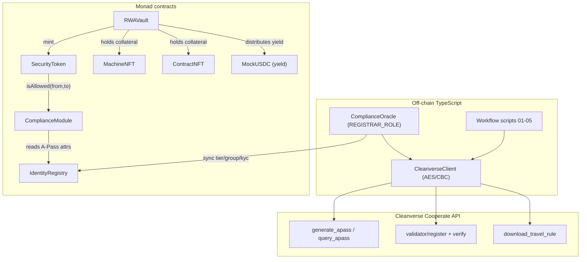
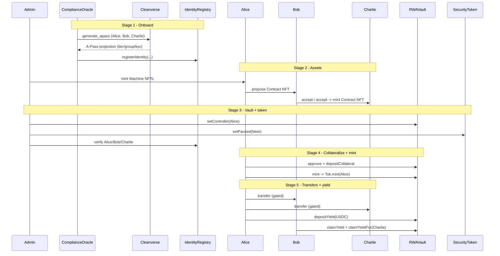

# Monad Machine RWA Platform (Cleanverse-native)

A reference implementation of an end-to-end **Real-World-Asset (RWA) tokenisation
flow on Monad**, where the identity and compliance backbone is provided by the
**Cleanverse Compliance Protocol (CCP)** rather than the Tokeny T-REX suite.

The platform tokenises physical machines, binds them to a multi-party legal
agreement, collateralises them inside a vault, and issues a **compliance-gated
security token** that can only move between **identity-verified wallets** — the
on-chain expression of Cleanverse's "verified identity + verified assets +
programmed Travel Rule" model.

> **Status:** contracts + scripts + tests. No frontend. The full multi-party
> demo runs against the local Hardhat network in **mock mode** (no Cleanverse
> credentials required). A **live mode** wires the same flow to the real
> Cleanverse Cooperate API and Monad testnet.
>
> **Machine token:** the deployed **MRWA** `SecurityToken` is the sole on-chain
> machine representation token. Cleanverse A-Pass handles identity today; full
> Cleanverse API coverage for MRWA (`verify_apass`, `download_travel_rule`, and
> related A-Token endpoints) requires **registering MRWA with Cleanverse** — a
> step this project will pursue with Cleanverse in a future release so those
> APIs work against the same token address.

---

## 1. Why Cleanverse instead of T-REX?

The requested workflow uses ERC-3643 / ONCHAINID vocabulary (identities, KYC
claims, Identity Registry, security token, compliance). Every one of those
concepts has a **direct Cleanverse analog**, so this project re-implements the
*interfaces* an ERC-3643 developer expects while making **Cleanverse the source
of truth** for identity and compliance:

| Workflow concept (ERC-3643 vocabulary) | Cleanverse primitive | This repo |
| --- | --- | --- |
| ONCHAINID identity | **A-Pass** (non-transferable identity token) via `POST /generate_apass` | `IdentityRegistry` (on-chain A-Pass projection) |
| KYC claims | A-Pass `tier` / `subTier` / `group` / `subGroup` / `currentKycHash` via `query_apass` | `Identity` struct fields |
| Identity Registry | **Validator compliance pool** (`/validator/register`, `/validator/verify`) | `IdentityRegistry` + `ComplianceModule` |
| Compliance module / rules | Cleanverse Rule object (`allowed_group`, `min_tier`, …) via `/validator/*rule*` | `ComplianceModule` (`Rule`) |
| Security token | compliance-gated **A-Token** (`set_paused`, MINTER_ROLE, gated transfers) | `SecurityToken` |
| Freeze / revoke | `update_status` (status 2 = Freeze) | `IdentityRegistry.setFrozen` |
| Travel Rule export | `POST /download_travel_rule` | `CleanverseClient.downloadTravelRule` (live mode) |

This maps cleanly onto Cleanverse's **4-layer compliance architecture**:

1. **Identity** – bank-verified A-Pass, local-only PII, revocable on blacklist → `IdentityRegistry`.
2. **Assets** – verified assets that move only between A-Pass wallets → `SecurityToken` + `RWAVault`.
3. **Governance** – consortium ruleset → `ComplianceModule` rules.
4. **Enforcement** – on-chain rules engine + audit-ready data → transfer hook + events + Travel Rule export.

### Could T-REX be used here?
T-REX (ERC-3643) is fully compatible *in shape* — `SecurityToken`, `IdentityRegistry`
and `ComplianceModule` mirror the T-REX `Token` / `IdentityRegistry` /
`ModularCompliance` triplet. The deliberate decision (per project scope) is to
**not** depend on the Tokeny packages and instead let Cleanverse own the identity
and compliance source of truth. Migrating to genuine ERC-3643 later only requires
swapping `SecurityToken` for a T-REX `Token` whose compliance module delegates to
the same Cleanverse data — the rest of the flow is unchanged.

---

## 2. Architecture



### Contracts (`contracts/`)

| Contract | Role |
| --- | --- |
| `identity/IdentityRegistry.sol` | On-chain projection of Cleanverse A-Pass records. Written only by `REGISTRAR_ROLE` (the off-chain oracle). |
| `identity/ComplianceModule.sol` | Validator-pool mirror. Holds `Rule`s and evaluates `verify` / `isAllowed` against the registry. Pausable (mirrors pool pause / code `12027`). |
| `token/SecurityToken.sol` | ERC-3643-style A-Token analog. Pausable; every `_update` is gated by the compliance module; `MINTER_ROLE` granted to the vault; controller can force-transfer/burn. |
| `assets/MachineNFT.sol` | ERC-721 machine, minted by `MACHINE_ISSUER_ROLE`, carries a declared valuation. |
| `assets/ContractNFT.sol` | Multi-party agreement NFT: propose → all parties accept → mint. |
| `vault/RWAVault.sol` | Collateral (Machine + Contract NFTs) → mint security tokens; yield deposit + pro-rata pull-claim (`claimYield`, `claimYieldFor`). |
| `mocks/MockUSDC.sol` | 6-decimal yield/origin stablecoin with a faucet. |
| `mocks/MockCleanverseValidator.sol` | Local stand-in for the on-chain Cleanverse Validator (`register`/`verify`/`setPaused`). |

### Off-chain (`src/cleanverse/`)

| File | Role |
| --- | --- |
| `crypto.ts` | AES `AES/CBC/PKCS5Padding`, fixed 16 zero-byte IV, Base64-decoded `api-key` as key. `encryptBody` produces the `{ data }` envelope. |
| `client.ts` | `CleanverseClient`: sends `api-id` header, encrypts the encrypted endpoints, wraps the `{code,message,data}` envelope. |
| `mode.ts` | `mock` (offline canned A-Pass) vs `live` (real gateway) service, selected by `CLEANVERSE_MODE`. |
| `complianceOracle.ts` | Holds `REGISTRAR_ROLE`; onboards users via Cleanverse and syncs the A-Pass projection into `IdentityRegistry`. |
| `types.ts` | TypeScript types mirroring the Cooperate API request/response shapes. |

---

## 3. The end-to-end workflow

The flow runs in order; each stage is a script and an exported function reused by
the tests and the `run-all` orchestrator.



1. **Onboard** – create A-Pass identities for Alice, Bob, Charlie; attach KYC claims; sync to `IdentityRegistry`. (`scripts/01-onboard.ts`)
2. **Asset side** – Machine Issuer mints Machine NFTs to Alice; Alice completes a multi-party Contract NFT with Bob and Charlie. (`scripts/02-assets.ts`)
3. **Vault and token** – Admin sets Alice as vault controller, configures the compliance rule, unpauses the security token, and verifies all three in the Identity Registry. (`scripts/03-vault-token.ts`)
4. **Collateralize and mint** – Alice approves the vault, deposits her Machine + Contract NFTs, and mints security tokens. (`scripts/04-collateralize-mint.ts`)
5. **Transfers and yield** – Alice transfers tokens to Bob and Charlie (a transfer to the un-onboarded Dave is blocked); Alice deposits yield; Bob claims yield for himself and on Charlie's behalf. (`scripts/05-transfers-yield.ts`)

---

## 4. Cleanverse encryption notes

- **`api-id`** is sent in the `api-id` request header; **`api-key`** is used only
  locally as the AES key and is **never transmitted**.
- Encrypted endpoints (e.g. `generate_apass`, `update_status`, `validator/grant`,
  `validator/register`, `validator/*rule*`, `validator/set_paused`,
  `atoken/*` mutations) send `{"data":"<Base64 ciphertext>"}`.
- Cipher: **AES/CBC/PKCS5Padding**, fixed **16 zero-byte IV**, key = Base64-decoded
  `api-key`, Base64 output, UTF-8 — implemented in `src/cleanverse/crypto.ts`.
- Plain-JSON endpoints (`query_apass`, `verify_apass`, `validator/verify`,
  `validator/rules`, `validator/is_*`, `query_*`, `faucet`,
  `download_travel_rule`) are sent unencrypted with just the `api-id` header.

---

## 5. Setup

### Requirements

- **Node.js 18 or 20 LTS** (Hardhat warns on v21+; the project runs on v23 but
  Node 20 is preferred for production use)
- **npm** (bundled with Node)
- A funded Monad testnet wallet and Cleanverse Cooperate API credentials are
  only required for live/testnet runs — all tests and the local workflow run
  fully offline in mock mode.

### Installation

```bash
git clone <repo>
cd "Monad RWA Framewok"
npm install
cp .env.example .env   # edit as needed — see variables table below
npm run build          # compile all Solidity contracts
```

### Environment variables (`.env`)

| Variable | Required for | Purpose |
| --- | --- | --- |
| `CLEANVERSE_MODE` | All runs | `mock` (default, offline) or `live` (real API). |
| `PRIVATE_KEY` | Monad testnet only | Deployer private key. |
| `MONAD_TESTNET_RPC` | Monad testnet only | Defaults to `https://testnet-rpc.monad.xyz`. |
| `CLEANVERSE_BASE_URL` | Live mode | Sandbox: `https://uatapi.cleanverse.com/api/cooperate`. |
| `CLEANVERSE_API_ID` | Live mode | `api-id` request header issued by Cleanverse. |
| `CLEANVERSE_API_KEY` | Live mode | Base64 AES-256 key (used locally only; never transmitted). |
| `CLEANVERSE_CHAIN` | Live mode | Chain slug for Cleanverse requests (default `monad`). |
| `ETHERSCAN_API_KEY` | Optional | Contract verification on block explorer. |

**Minimum `.env` for offline testing (no credentials needed):**

```
CLEANVERSE_MODE=mock
PRIVATE_KEY=0xac0974bec39a17e36ba4a6b4d238ff944bacb478cbed5efcae784d7bf4f2ff80
```

---

## 6. Test Guide

### 6.1 Unit tests — run offline, no credentials

```bash
npm test
```

This runs three test suites totalling **9 tests**. All tests use the in-process
Hardhat network and `CLEANVERSE_MODE=mock` — no wallet, no API key, no internet
connection needed.

**Expected output:**

```
  Cleanverse AES crypto
    ✔ round-trips a JSON payload
    ✔ wraps bodies into the { data } envelope
    ✔ supports 16/24/32 byte keys and rejects others

  IdentityRegistry + ComplianceModule
    ✔ verifies a registered, unfrozen, unexpired wallet
    ✔ rejects unknown and frozen wallets
    ✔ enforces min tier and group rules
    ✔ reverts verify when the pool is paused

  Full Machine RWA workflow (mock mode)
    ✔ runs onboard -> assets -> vault -> mint -> transfers -> yield
    ✔ blocks transfers to wallets without an A-Pass

  9 passing
```

---

### 6.2 What each test suite covers

#### `test/crypto.spec.ts` — Cleanverse AES crypto (3 tests)

Verifies the `src/cleanverse/crypto.ts` encryption layer that all sensitive
Cooperate API calls depend on.

| Test | What it proves |
| --- | --- |
| Round-trips a JSON payload | `encrypt` → `decrypt` returns the original string; ciphertext is valid Base64. |
| Wraps bodies into `{ data }` envelope | `encryptBody` produces the `{"data":"<ciphertext>"}` shape the API expects. |
| Supports 16/24/32-byte keys, rejects others | AES key-length validation matches the Cleanverse spec; bad lengths throw. |

#### `test/compliance.spec.ts` — IdentityRegistry + ComplianceModule (4 tests)

Unit-tests the two identity/compliance contracts in isolation, without the full
workflow stack.

| Test | What it proves |
| --- | --- |
| Verifies a registered, unfrozen, unexpired wallet | `compliance.verify(alice)` returns `true` after `registerIdentity`. |
| Rejects unknown and frozen wallets | Unknown wallet → `false`; frozen wallet → `false` even if registered. |
| Enforces min tier and group rules | Rule with `minTier=5, allowedGroup="AA"` passes Alice (tier 30, group AA) and fails Bob (tier 3, group BB). |
| Reverts verify when the pool is paused | `setPaused(true)` causes `compliance.verify` to revert with `"ComplianceModule: pool paused"`. |

#### `test/fullFlow.spec.ts` — Full Machine RWA workflow (2 tests)

End-to-end integration test: deploys all contracts, runs all five stages, and
asserts the precise on-chain state after each one.

**Test 1 — Happy path (all 5 stages):**

```
Stage 1 Onboard
  Alice, Bob, Charlie receive A-Pass projections via mock Cleanverse.
  Assert: identityRegistry.isVerified(alice/bob/charlie) === true

Stage 2 Assets
  Issuer mints 2 Machine NFTs to Alice.
  Alice proposes a ContractNFT; Bob and Charlie both accept() → NFT mints.
  Assert: ctx.state.machineIds.length === 2
  Assert: contractNFT.ownerOf(contractTokenId) === alice (pre-deposit)

Stage 3 Vault & Token
  Admin sets Alice as vault controller; configures compliance rule (tier ≥ 20);
  unpauses SecurityToken; verifies all three participants.
  Assert: securityToken.paused() === false

Stage 4 Collateralise & Mint
  Alice approves and deposits both NFTs into the vault.
  Vault mints 1,000 MRWA to Alice.
  Assert: securityToken.balanceOf(alice) === 1,000 MRWA
  Assert: contractNFT.ownerOf(contractTokenId) === vault (collateral in custody)

Stage 5 Transfers & Yield
  Alice transfers 100 MRWA to Bob and 100 MRWA to Charlie (both pass compliance).
  Alice deposits 30 USDC yield into the vault.
  Bob claims yield; Bob calls claimYieldFor(Charlie).
  Assert: balanceOf(bob)     === 100 MRWA
  Assert: balanceOf(charlie) === 100 MRWA
  Assert: USDC balance(bob)     === 3 USDC  (100/1000 × 30)
  Assert: USDC balance(charlie) === 3 USDC  (100/1000 × 30)
```

**Test 2 — Compliance gate blocks un-onboarded wallet:**

```
Runs stages 1–4, then attempts:
  alice.transfer(dave, 1 MRWA)

Dave has no A-Pass in the IdentityRegistry.
Assert: reverts with custom error NotCompliant
```

---

### 6.3 Full workflow — local (mock mode, no credentials)

#### Option A — single process (recommended for first run)

Deploys all contracts and runs all five stages in a single in-memory Hardhat
process. No persistent node needed.

```bash
npm run flow:all
```

#### Option B — stage-by-stage against a persistent local node

Useful for inspecting state between stages. State is saved to
`deployments.local.json` between runs.

```bash
# Terminal 1 — start the local node (keep it running)
npm run node

# Terminal 2 — run stages individually
npm run flow:01   # deploy + Stage 1: Onboard
npm run flow:02   # Stage 2: Assets
npm run flow:03   # Stage 3: Vault + token
npm run flow:04   # Stage 4: Collateralise + mint
npm run flow:05   # Stage 5: Transfers + yield
```

---

### 6.4 Full workflow — Monad testnet (live mode)

#### Prerequisites

1. **Fund the deployer wallet** with testnet MON from <https://testnet.monad.xyz>.
   The workflow scripts derive Alice/Bob/Charlie/Dave wallets deterministically
   from `PRIVATE_KEY` and top each one up to 0.5 MON automatically.
2. **Cleanverse credentials** in `.env` (`CLEANVERSE_API_ID`, `CLEANVERSE_API_KEY`,
   `CLEANVERSE_BASE_URL`, `CLEANVERSE_MODE=live`).

#### Deploy + full 5-stage workflow

```bash
npm run flow:monad
```

Deploys all contracts via Hardhat Ignition, then runs all five stages on Monad
testnet with live Cleanverse API calls. Contract addresses are saved to
`deployments.monad.json`.

#### Audit an existing deployment

```bash
npm run flow:monad:audit
```

Reads `deployments.monad.json`, queries Cleanverse A-Pass for Alice and Bob,
transfers 10 MRWA Alice → Bob, attempts a Travel Rule report, and saves a full
audit record to `deployments.cleanverse-audit.json`.

**Sample output (live run, June 18 2026):**

```
=== MRWA machine token: 0xcCbe9DA3A0c1FDB7D12957171169BEcB55c37D1f ===

=== Cleanverse A-Pass (identity) ===

alice query_apass: tier=20 cvRecordId=428
alice verify_apass (MRWA): code=1 (atoken not exist)   ← pending registration
bob   query_apass: tier=20 cvRecordId=429
bob   verify_apass (MRWA): code=1 (atoken not exist)

=== MRWA transfer (on-chain A-Pass compliance) ===

Alice MRWA balance: 790.0
Alice -> Bob 10.0 MRWA
Tx: https://testnet.monadscan.com/tx/0xbbb829dd...

=== download_travel_rule ===

code=0002 [TR_001] Transaction not found.   ← pending MRWA registration with Cleanverse

Saved deployments.cleanverse-audit.json
```

> `verify_apass` and `download_travel_rule` return errors because MRWA is not
> yet registered with Cleanverse as an A-Token. This does **not** affect the
> on-chain compliance flow — transfers are gated by the A-Pass-synced
> `IdentityRegistry`. Full Cleanverse API support for MRWA is planned; see §8.

#### Deploy only (no workflow scripts)

```bash
npm run deploy:monad
```

---

### 6.5 All npm scripts at a glance

| Script | What it runs |
| --- | --- |
| `npm test` | Hardhat test runner — 9 unit + integration tests (mock, offline) |
| `npm run build` | Compile all Solidity contracts via `hardhat compile` |
| `npm run node` | Start a persistent local Hardhat node (use with `flow:01`–`flow:05`) |
| `npm run flow:all` | Deploy + stages 1–5, in-process Hardhat, mock mode |
| `npm run flow:01` | Stage 1 only against `npm run node` |
| `npm run flow:02` | Stage 2 only |
| `npm run flow:03` | Stage 3 only |
| `npm run flow:04` | Stage 4 only |
| `npm run flow:05` | Stage 5 only |
| `npm run flow:monad` | Deploy + stages 1–5 on Monad testnet (live mode) |
| `npm run flow:monad:audit` | A-Pass query + MRWA transfer + Travel Rule audit on existing Monad deployment |
| `npm run deploy:monad` | Ignition deploy only, no workflow scripts |

---

### 6.6 Deployed addresses (Monad testnet)

Saved automatically to `deployments.monad.json` after `npm run flow:monad`.
All addresses link to [testnet.monadscan.com](https://testnet.monadscan.com).

| Contract | Address | Explorer |
| --- | --- | --- |
| MockUSDC | `0xCf4E9D4a44fE037a84Ff9BFeC3aC7A4e98593Cd7` | [↗ view](https://testnet.monadscan.com/address/0xCf4E9D4a44fE037a84Ff9BFeC3aC7A4e98593Cd7) |
| IdentityRegistry | `0x80a58Ec090F6b54967aD41579D816a225A3C85C3` | [↗ view](https://testnet.monadscan.com/address/0x80a58Ec090F6b54967aD41579D816a225A3C85C3) |
| ComplianceModule | `0x15e3F9D35b6436Ce500Bd8f2Cc60A5Cc94C494F7` | [↗ view](https://testnet.monadscan.com/address/0x15e3F9D35b6436Ce500Bd8f2Cc60A5Cc94C494F7) |
| **SecurityToken (MRWA)** | **`0xcCbe9DA3A0c1FDB7D12957171169BEcB55c37D1f`** | [↗ view](https://testnet.monadscan.com/address/0xcCbe9DA3A0c1FDB7D12957171169BEcB55c37D1f) |
| MachineNFT | `0x9c045330fddD6Ef59Da9fE2784BC1321Ed33AA9F` | [↗ view](https://testnet.monadscan.com/address/0x9c045330fddD6Ef59Da9fE2784BC1321Ed33AA9F) |
| ContractNFT | `0x086CAad51b5d709EF94F03815abcd5c554AD6A60` | [↗ view](https://testnet.monadscan.com/address/0x086CAad51b5d709EF94F03815abcd5c554AD6A60) |
| RWAVault | `0xCAE0bB0E82BBCbeD3eB3089Df64cc4071b53524f` | [↗ view](https://testnet.monadscan.com/address/0xCAE0bB0E82BBCbeD3eB3089Df64cc4071b53524f) |

Participant wallets are derived deterministically from `PRIVATE_KEY`:

| Role | Address | Explorer |
| --- | --- | --- |
| Deployer | `0xd41587F9D5df02662Afa4AC60626154985E9149A` | [↗ view](https://testnet.monadscan.com/address/0xd41587F9D5df02662Afa4AC60626154985E9149A) |
| Alice | `0xD37b28E02f3f7d5D4f23F2b6671AA36aC0F66871` | [↗ view](https://testnet.monadscan.com/address/0xD37b28E02f3f7d5D4f23F2b6671AA36aC0F66871) |
| Bob | `0x62343276DF60740C2bAd2A0D7E357a02FAaC8B43` | [↗ view](https://testnet.monadscan.com/address/0x62343276DF60740C2bAd2A0D7E357a02FAaC8B43) |
| Charlie | `0xD9D6Ea0af4D6Eb7eBde2aDBb11b5108C4c309575` | [↗ view](https://testnet.monadscan.com/address/0xD9D6Ea0af4D6Eb7eBde2aDBb11b5108C4c309575) |
| Dave | `0xb6815FD932151C28ECCb037B3C1b439cE8E82Cbf` | [↗ view](https://testnet.monadscan.com/address/0xb6815FD932151C28ECCb037B3C1b439cE8E82Cbf) |

**Notable transactions:**

| Event | Tx | Explorer |
| --- | --- | --- |
| First compliance-gated MRWA transfer (flow:monad) | `0x0cffcc1a...7904fd4` | [↗ view](https://testnet.monadscan.com/tx/0x0cffcc1a46a9999fc4378afc87dc1d60b0ce8ae4950f74e6afeee037b7904fd4) |
| Audit transfer Alice → Bob 10 MRWA (flow:monad:audit) | `0xbbb829dd...b839a` | [↗ view](https://testnet.monadscan.com/tx/0xbbb829dd10a29ea030ba2ab36f0e0ef54383170c0129ff40b0652df4c04b839a) |

---

## 7. Mock vs. live mode — summary

| | `mock` | `live` |
| --- | --- | --- |
| Cleanverse calls | Deterministic in-memory A-Pass | Real Cooperate API (`uatapi.cleanverse.com`) |
| Credentials | None | `CLEANVERSE_API_ID` + `CLEANVERSE_API_KEY` |
| Identity source | `MockCleanverseService` | `generate_apass` / `query_apass` |
| Verification | local map | `validator/verify` |
| Travel Rule | skipped | `download_travel_rule` (requires Cleanverse-registered A-Token; see §8) |

The on-chain contracts are identical in both modes; only the off-chain identity
source changes. This keeps the demo fully runnable offline while proving the live
integration path.

---

## 8. Security and limitations

- **Demo collateral model**: the vault mints security tokens 1:1 against declared
  machine valuations. Production systems need oracle-priced collateral, LTV
  limits, liquidation, and redemption.
- **Yield accounting** uses the standard accumulator pattern and assumes token
  distribution is settled before each yield deposit (true for the reference
  flow). For arbitrary interleaved transfers, move to a transfer-hook-aware
  dividend tracker.
- **Role custody**: deployer holds admin/registrar/issuer/pauser roles for the
  demo. In production, separate these across multisigs / the Cleanverse gateway.
- **MRWA vs. Cleanverse A-Token registration (current):** this repo deploys and
  uses a custom `SecurityToken` (**MRWA**) for vault minting, transfers, and
  on-chain compliance (via the A-Pass-synced `IdentityRegistry`). In live mode,
  `verify_apass` and `download_travel_rule` against the MRWA address currently
  return errors such as `atoken not exist` / `TR_001` because Cleanverse only
  indexes tokens it has registered. That does **not** block the on-chain workflow.
- **Future work with Cleanverse:** the project will coordinate with Cleanverse to
  register MRWA (via `atoken/launch` or `register_atoken`, subject to Cleanverse
  approval) so the same MRWA contract address is recognized as a Cleanverse
  A-Token. Once registered, `verify_apass`, `download_travel_rule`, institutional
  whitelist flows, and other Cooperate API endpoints will apply to MRWA transfers
  without changing the vault or workflow scripts. The client already wraps
  `atoken/launch`, `atoken/set_paused`, and related APIs for when registration
  is available.
- `MockUSDC` and `MockCleanverseValidator` are test doubles and must not be
  deployed to production.

---

## 9. Project layout

```
contracts/
  identity/   IdentityRegistry, IIdentityRegistry, ComplianceModule
  token/      SecurityToken
  assets/     MachineNFT, ContractNFT
  vault/      RWAVault
  mocks/      MockUSDC, MockCleanverseValidator
src/cleanverse/  crypto, client, mode, complianceOracle, types
ignition/modules/RWAPlatform.ts
scripts/     context, stages, run-all, 01-05 stage runners
test/        crypto, compliance, fullFlow
```
