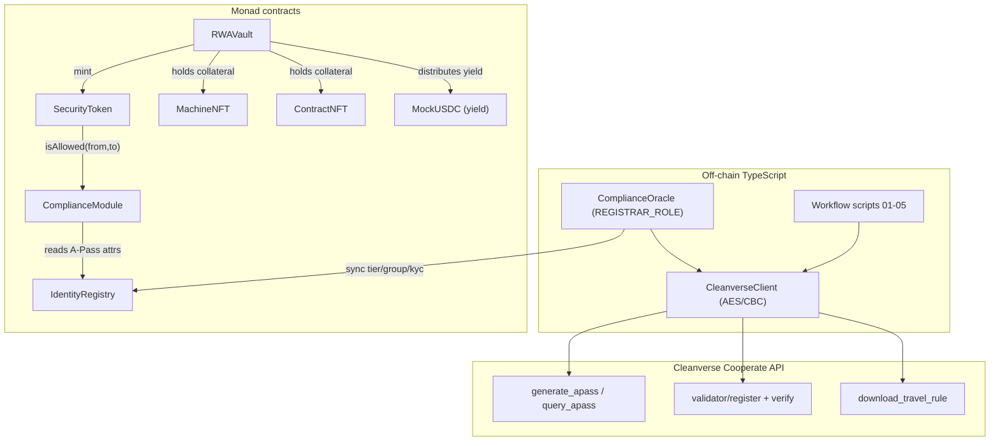
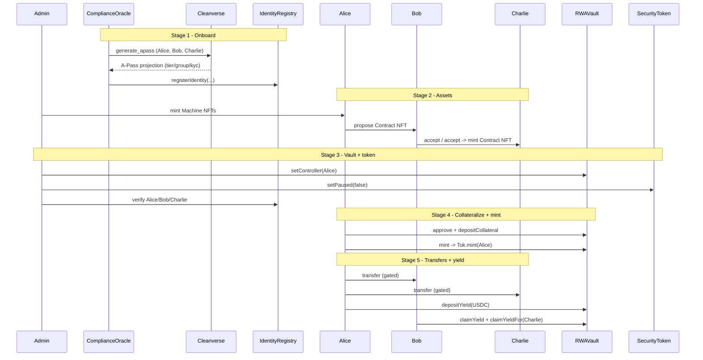

# Monad Machine RWA Platform (Cleanverse-native)

A reference implementation of an end-to-end **Real-World-Asset (RWA) tokenisation
flow on Monad**, where the identity and compliance backbone is provided by the
**Cleanverse Compliance Protocol (CCP)** rather than the Tokeny T-REX suite.

The platform tokenises physical machines, binds them to a multi-party legal
agreement, collateralises them inside a vault, and issues a **compliance-gated
security token** that can only move between **identity-verified wallets** — the
on-chain expression of Cleanverse's "verified identity + verified assets +
programmed Travel Rule" model.

> **Status:** contracts + scripts + tests. No frontend. The full multi-party
> demo runs against the local Hardhat network in **mock mode** (no Cleanverse
> credentials required). A **live mode** wires the same flow to the real
> Cleanverse Cooperate API and Monad testnet.
>
> **Machine token:** the deployed **MRWA** `SecurityToken` is the sole on-chain
> machine representation token. Cleanverse A-Pass handles identity today; full
> Cleanverse API coverage for MRWA (`verify_apass`, `download_travel_rule`, and
> related A-Token endpoints) requires **registering MRWA with Cleanverse** — a
> step this project will pursue with Cleanverse in a future release so those
> APIs work against the same token address.

---

## 1. Why Cleanverse instead of T-REX?

The requested workflow uses ERC-3643 / ONCHAINID vocabulary (identities, KYC
claims, Identity Registry, security token, compliance). Every one of those
concepts has a **direct Cleanverse analog**, so this project re-implements the
*interfaces* an ERC-3643 developer expects while making **Cleanverse the source
of truth** for identity and compliance:

| Workflow concept (ERC-3643 vocabulary) | Cleanverse primitive | This repo |
| --- | --- | --- |
| ONCHAINID identity | **A-Pass** (non-transferable identity token) via `POST /generate_apass` | `IdentityRegistry` (on-chain A-Pass projection) |
| KYC claims | A-Pass `tier` / `subTier` / `group` / `subGroup` / `currentKycHash` via `query_apass` | `Identity` struct fields |
| Identity Registry | **Validator compliance pool** (`/validator/register`, `/validator/verify`) | `IdentityRegistry` + `ComplianceModule` |
| Compliance module / rules | Cleanverse Rule object (`allowed_group`, `min_tier`, …) via `/validator/*rule*` | `ComplianceModule` (`Rule`) |
| Security token | compliance-gated **A-Token** (`set_paused`, MINTER_ROLE, gated transfers) | `SecurityToken` |
| Freeze / revoke | `update_status` (status 2 = Freeze) | `IdentityRegistry.setFrozen` |
| Travel Rule export | `POST /download_travel_rule` | `CleanverseClient.downloadTravelRule` (live mode) |

This maps cleanly onto Cleanverse's **4-layer compliance architecture**:

1. **Identity** – bank-verified A-Pass, local-only PII, revocable on blacklist → `IdentityRegistry`.
2. **Assets** – verified assets that move only between A-Pass wallets → `SecurityToken` + `RWAVault`.
3. **Governance** – consortium ruleset → `ComplianceModule` rules.
4. **Enforcement** – on-chain rules engine + audit-ready data → transfer hook + events + Travel Rule export.

### Could T-REX be used here?
T-REX (ERC-3643) is fully compatible *in shape* — `SecurityToken`, `IdentityRegistry`
and `ComplianceModule` mirror the T-REX `Token` / `IdentityRegistry` /
`ModularCompliance` triplet. The deliberate decision (per project scope) is to
**not** depend on the Tokeny packages and instead let Cleanverse own the identity
and compliance source of truth. Migrating to genuine ERC-3643 later only requires
swapping `SecurityToken` for a T-REX `Token` whose compliance module delegates to
the same Cleanverse data — the rest of the flow is unchanged.

---

## 2. Architecture



### Contracts (`contracts/`)

| Contract | Role |
| --- | --- |
| `identity/IdentityRegistry.sol` | On-chain projection of Cleanverse A-Pass records. Written only by `REGISTRAR_ROLE` (the off-chain oracle). |
| `identity/ComplianceModule.sol` | Validator-pool mirror. Holds `Rule`s and evaluates `verify` / `isAllowed` against the registry. Pausable (mirrors pool pause / code `12027`). |
| `token/SecurityToken.sol` | ERC-3643-style A-Token analog. Pausable; every `_update` is gated by the compliance module; `MINTER_ROLE` granted to the vault; controller can force-transfer/burn. |
| `assets/MachineNFT.sol` | ERC-721 machine, minted by `MACHINE_ISSUER_ROLE`, carries a declared valuation. |
| `assets/ContractNFT.sol` | Multi-party agreement NFT: propose → all parties accept → mint. |
| `vault/RWAVault.sol` | Collateral (Machine + Contract NFTs) → mint security tokens; yield deposit + pro-rata pull-claim (`claimYield`, `claimYieldFor`). |
| `mocks/MockUSDC.sol` | 6-decimal yield/origin stablecoin with a faucet. |
| `mocks/MockCleanverseValidator.sol` | Local stand-in for the on-chain Cleanverse Validator (`register`/`verify`/`setPaused`). |

### Off-chain (`src/cleanverse/`)

| File | Role |
| --- | --- |
| `crypto.ts` | AES `AES/CBC/PKCS5Padding`, fixed 16 zero-byte IV, Base64-decoded `api-key` as key. `encryptBody` produces the `{ data }` envelope. |
| `client.ts` | `CleanverseClient`: sends `api-id` header, encrypts the encrypted endpoints, wraps the `{code,message,data}` envelope. |
| `mode.ts` | `mock` (offline canned A-Pass) vs `live` (real gateway) service, selected by `CLEANVERSE_MODE`. |
| `complianceOracle.ts` | Holds `REGISTRAR_ROLE`; onboards users via Cleanverse and syncs the A-Pass projection into `IdentityRegistry`. |
| `types.ts` | TypeScript types mirroring the Cooperate API request/response shapes. |

---

## 3. The end-to-end workflow

The flow runs in order; each stage is a script and an exported function reused by
the tests and the `run-all` orchestrator.



1. **Onboard** – create A-Pass identities for Alice, Bob, Charlie; attach KYC claims; sync to `IdentityRegistry`. (`scripts/01-onboard.ts`)
2. **Asset side** – Machine Issuer mints Machine NFTs to Alice; Alice completes a multi-party Contract NFT with Bob and Charlie. (`scripts/02-assets.ts`)
3. **Vault and token** – Admin sets Alice as vault controller, configures the compliance rule, unpauses the security token, and verifies all three in the Identity Registry. (`scripts/03-vault-token.ts`)
4. **Collateralize and mint** – Alice approves the vault, deposits her Machine + Contract NFTs, and mints security tokens. (`scripts/04-collateralize-mint.ts`)
5. **Transfers and yield** – Alice transfers tokens to Bob and Charlie (a transfer to the un-onboarded Dave is blocked); Alice deposits yield; Bob claims yield for himself and on Charlie's behalf. (`scripts/05-transfers-yield.ts`)

---

## 4. Cleanverse encryption notes

- **`api-id`** is sent in the `api-id` request header; **`api-key`** is used only
  locally as the AES key and is **never transmitted**.
- Encrypted endpoints (e.g. `generate_apass`, `update_status`, `validator/grant`,
  `validator/register`, `validator/*rule*`, `validator/set_paused`,
  `atoken/*` mutations) send `{"data":"<Base64 ciphertext>"}`.
- Cipher: **AES/CBC/PKCS5Padding**, fixed **16 zero-byte IV**, key = Base64-decoded
  `api-key`, Base64 output, UTF-8 — implemented in `src/cleanverse/crypto.ts`.
- Plain-JSON endpoints (`query_apass`, `verify_apass`, `validator/verify`,
  `validator/rules`, `validator/is_*`, `query_*`, `faucet`,
  `download_travel_rule`) are sent unencrypted with just the `api-id` header.

---

## 5. Setup

Requirements: Node.js 18 or 20 LTS (Hardhat warns on newer majors), npm.

```bash
npm install
cp .env.example .env   # then edit values
npm run build          # compile contracts
npm test               # run the unit + full-flow tests
```

### Environment variables (`.env`)

| Variable | Purpose |
| --- | --- |
| `PRIVATE_KEY` | Deployer key for Monad testnet (testnet only). |
| `MONAD_TESTNET_RPC` | Defaults to `https://testnet-rpc.monad.xyz`. |
| `ETHERSCAN_API_KEY` | Optional, for contract verification. |
| `CLEANVERSE_MODE` | `mock` (default, offline) or `live`. |
| `CLEANVERSE_BASE_URL` | Sandbox `https://uatapi.cleanverse.com/api/cooperate`. |
| `CLEANVERSE_API_ID` | `api-id` header (live mode). |
| `CLEANVERSE_API_KEY` | Base64 AES key (live mode, local use only). |
| `CLEANVERSE_CHAIN` | Chain slug for Cleanverse requests (default `monad`). |

---

## 6. Running the demo

### A. Full flow in one process (recommended)

Runs deploy + all five stages on the in-process Hardhat network in mock mode:

```bash
npm run flow:all
```

### B. Stage-by-stage against a persistent local node

Because the default Hardhat network is per-process, run the stages against a
standalone node so deployment/state persists between them:

```bash
# terminal 1
npm run node

# terminal 2 (state is saved to deployments.local.json between stages)
npm run flow:01   # deploys + onboards
npm run flow:02
npm run flow:03
npm run flow:04
npm run flow:05
```

### C. Deploy to Monad testnet

```bash
npm run deploy:monad      # hardhat ignition deploy ... --network monadTestnet
npm run flow:monad        # deploy + full 5-stage workflow on Monad testnet
npm run flow:monad:audit  # MRWA transfer + Cleanverse audit on existing deployment
```

> Fund the deployer with testnet MON from <https://testnet.monad.xyz>. The
> multi-party workflow scripts need Alice/Bob/Charlie signers; on a public
> network you must supply funded keys for them (the default scripts use the
> local Hardhat signer set). Contract deployment to Monad works with a single
> deployer key.

---

## 7. Mock vs. live mode

| | `mock` | `live` |
| --- | --- | --- |
| Cleanverse calls | Deterministic in-memory A-Pass | Real Cooperate API (`uatapi.cleanverse.com`) |
| Credentials | None | `CLEANVERSE_API_ID` + `CLEANVERSE_API_KEY` |
| Identity source | `MockCleanverseService` | `generate_apass` / `query_apass` |
| Verification | local map | `validator/verify` |
| Travel Rule | skipped | `download_travel_rule` (requires Cleanverse-registered A-Token; see §8) |

The on-chain contracts are identical in both modes; only the off-chain identity
source changes. This keeps the demo fully runnable offline while proving the live
integration path.

---

## 8. Security and limitations

- **Demo collateral model**: the vault mints security tokens 1:1 against declared
  machine valuations. Production systems need oracle-priced collateral, LTV
  limits, liquidation, and redemption.
- **Yield accounting** uses the standard accumulator pattern and assumes token
  distribution is settled before each yield deposit (true for the reference
  flow). For arbitrary interleaved transfers, move to a transfer-hook-aware
  dividend tracker.
- **Role custody**: deployer holds admin/registrar/issuer/pauser roles for the
  demo. In production, separate these across multisigs / the Cleanverse gateway.
- **MRWA vs. Cleanverse A-Token registration (current):** this repo deploys and
  uses a custom `SecurityToken` (**MRWA**) for vault minting, transfers, and
  on-chain compliance (via the A-Pass-synced `IdentityRegistry`). In live mode,
  `verify_apass` and `download_travel_rule` against the MRWA address currently
  return errors such as `atoken not exist` / `TR_001` because Cleanverse only
  indexes tokens it has registered. That does **not** block the on-chain workflow.
- **Future work with Cleanverse:** the project will coordinate with Cleanverse to
  register MRWA (via `atoken/launch` or `register_atoken`, subject to Cleanverse
  approval) so the same MRWA contract address is recognized as a Cleanverse
  A-Token. Once registered, `verify_apass`, `download_travel_rule`, institutional
  whitelist flows, and other Cooperate API endpoints will apply to MRWA transfers
  without changing the vault or workflow scripts. The client already wraps
  `atoken/launch`, `atoken/set_paused`, and related APIs for when registration
  is available.
- `MockUSDC` and `MockCleanverseValidator` are test doubles and must not be
  deployed to production.

---

## 9. Project layout

```
contracts/
  identity/   IdentityRegistry, IIdentityRegistry, ComplianceModule
  token/      SecurityToken
  assets/     MachineNFT, ContractNFT
  vault/      RWAVault
  mocks/      MockUSDC, MockCleanverseValidator
src/cleanverse/  crypto, client, mode, complianceOracle, types
ignition/modules/RWAPlatform.ts
scripts/     context, stages, run-all, 01-05 stage runners
test/        crypto, compliance, fullFlow
```
